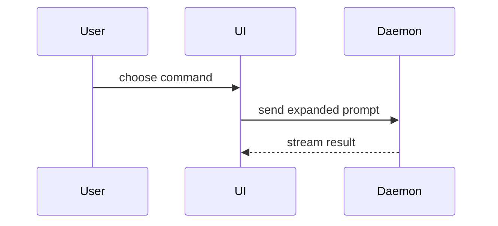

# show-me — the smallest picture that answers the question

A second paragraph never fixes the first one. Pick the smallest view that makes the point, put two
lines of prose beside it, stop.

## The contract

1. **One form, chosen on purpose.** Read what the question is *about*, pick the matching form from
   the table, draw that. Several forms in one answer is the failure mode, not thoroughness.
2. **Only the parts that answer the question.** Keep the calls, files, props, states and boundaries
   the user asked about. Everything else is noise that hides the answer.
3. **Prose shrinks to fit.** No preamble, no "here is a diagram of". The picture leads; the words
   caption it.
4. **Real names.** Actual paths, actual function and component names, actual state values. A diagram
   of `ServiceA → ServiceB` explains nothing.
5. **Say so when there is nothing to draw.** A topic with no shape gets a straight answer in prose.
   A decorative diagram costs the reader time and buys nothing.

## Pick the form from what the topic is

| The question is about | Draw | Why this one |
| --- | --- | --- |
| Logic, an algorithm, a decision | pseudocode | branches read top-down; syntax would distract |
| What calls what at runtime | call tree | shows order and nesting, which prose loses |
| UI structure | component tree, with state and module boundaries | ownership is the answer most of the time |
| Which file is responsible for what | shallow file tree with one comment per entry | depth hides the point; one level shows it |
| Interaction, control flow, data flow between pieces | Mermaid sequence or flow diagram | two-way traffic over time needs an axis |
| What changes in a shape that already exists | `diff`, in the shape of the topic | the reader keeps their bearings |
| Layout, visual state, a dense comparison | one self-contained HTML page | text cannot hold it |
| Nothing with a shape | prose | see contract rule 5 |

```text
on(save)
  if content is unchanged
    return cached result
  write new content
  return fresh result
```

```text
submitForm
  createSession
    persistPrompt
    launchAgent
  navigateToSession
```

```tsx
<SessionPage> (apps/example/src/routes/session.tsx)
  useSessionEvents()
  <SessionToolbar>
    <RunSkillButton> (packages/ui)
```

```text
src/
├── commands/       # parses user actions
├── sessions/       # owns session state
└── transport/      # sends API requests
```



## The diff rule

Use `diff` when the surrounding shape already exists and the point is what moves. **Match the diff
to the topic**: a component change is a component diff, a layout change is a file-tree diff, a
control-flow change is a pseudocode diff. A unified source diff for a structural change makes the
reader rebuild the structure in their head.

```diff
 src/
 ├── commands/
+│   └── show-me.ts       # expands the slash command
 ├── sessions/
-└── transport.ts
+└── transport/
+    ├── client.ts
+    └── stream.ts
```

```diff
 on(save)
-  write content
+  if content is unchanged
+    return cached result
+  write new content
+  invalidate cache
```

Show the whole block instead of a diff when most of it is new, when the omitted context would hide
ownership or order, or when the user needs something copyable.

## When it earns an HTML page

Layout, visual state, a side-by-side comparison, or a concept too dense for a text diagram. One
page, self-contained, real labels and real data, readable on a phone and on a desktop. Inherit the
product's colours, type and spacing from where it lives; this skill borrows an identity, it never
invents one. Then open it:

```bash
open path/to/show-me-<topic>.html
```

## Anti-patterns

| Anti-pattern | Why it fails | Do this instead |
| --- | --- | --- |
| Ship four forms because each adds a little | The reader now has to pick; that was your job | One form, the smallest that answers it |
| Diagram the whole system when asked about one path | The answer is in there somewhere, which is the same as absent | Draw the path, drop the rest |
| Placeholder names (`ModuleA`, `doThing`) | Nothing maps back to the codebase | Real paths and real identifiers |
| A unified source diff for a structural change | Forces the reader to rebuild the shape | Diff in the shape of the topic |
| Mermaid for a layout question | Boxes and arrows cannot show visual space | One HTML page |
| A diagram to look thorough | Costs attention, adds nothing | Answer in prose and say why there is nothing to draw |

## Where this ends

- The visual **identity** of an interface, a landing page or a poster is `design-loop` and `design`.
- A **deck** someone presents from is `presentations`.
- **Zero prior knowledge**, big pictures, few words, is `eli5`.
- Restructuring a document, a README or a reference is `technical-writing`.
- A guided tour of an unfamiliar repository is `codebase-onboarding`; this skill draws the pieces it
  finds, it does not run the tour.
